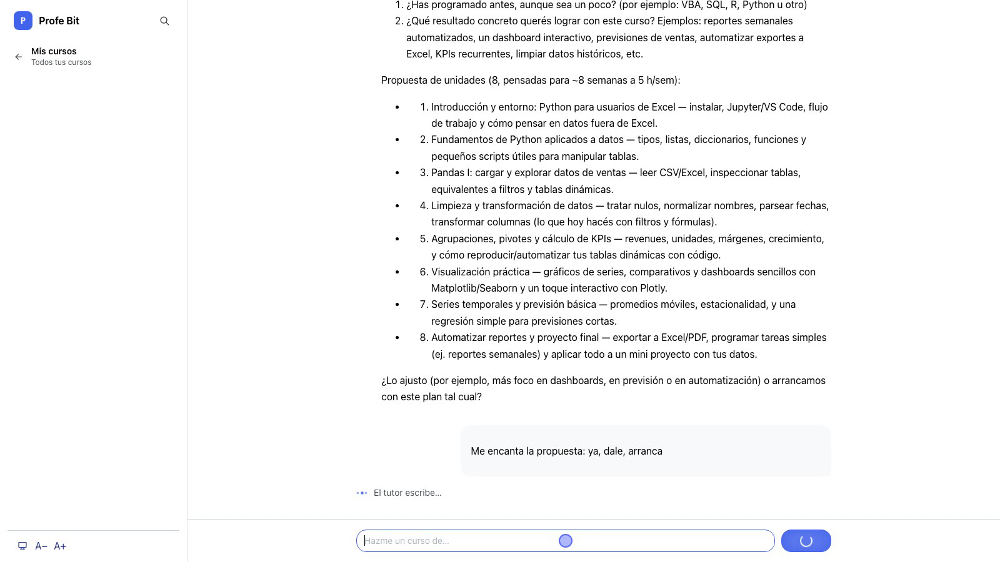
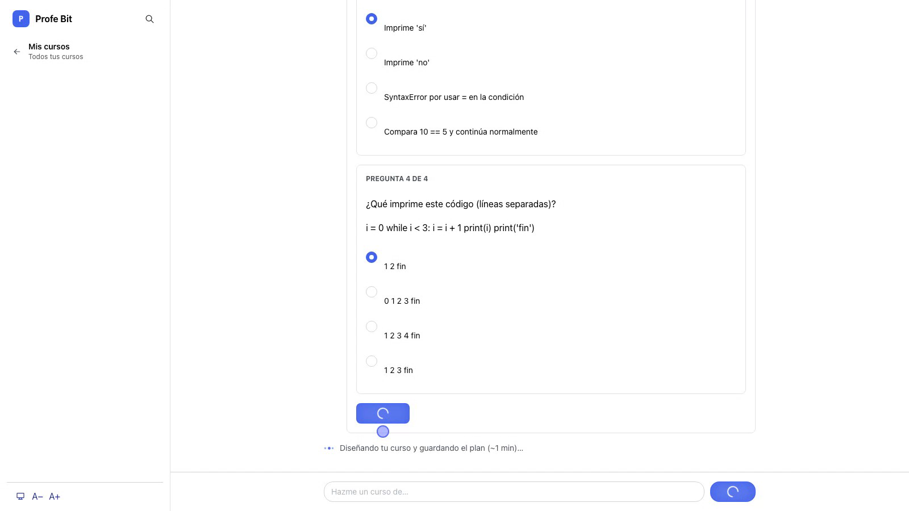
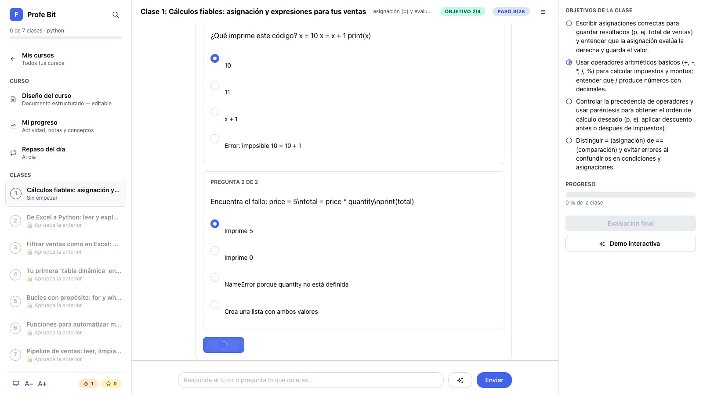
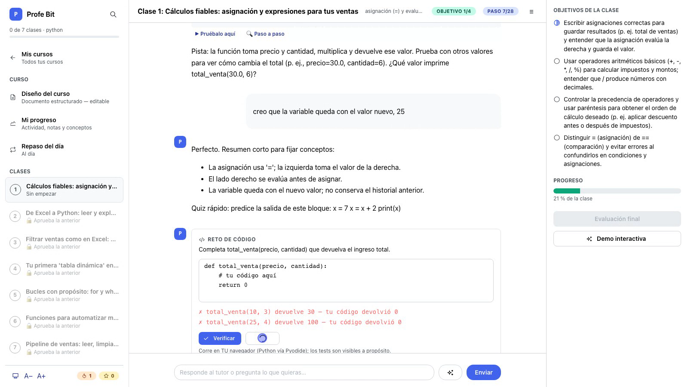
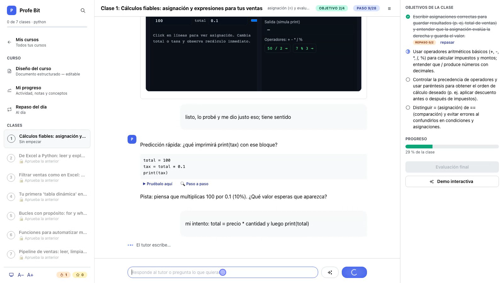
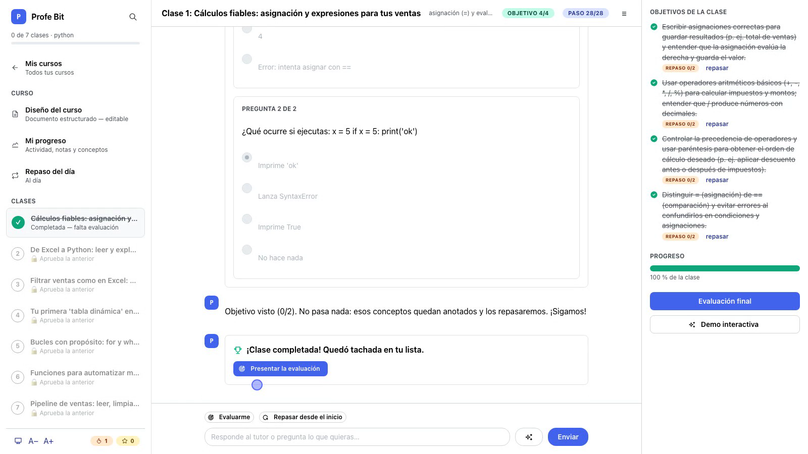

# Profe Bit — Tutor de Programación con LLMs

**Profe Bit** es un agente tutor que enseña fundamentos de programación
donde **todo pasa conversando**: pides tu curso con tus palabras, un asesor
te entrevista y te aplica un **examen diagnóstico**, y el curso completo se
diseña a tu medida. Cada clase es una conversación con objetivos que se
cumplen en vivo, retos de código verificados en tu navegador, mini-quices,
demos interactivas generadas por el LLM y una evaluación final con niveles
de Bloom y nota ponderada.

Trabajo 02 del curso *Normalización: aplicaciones de LLMs y Agentes para la
enseñanza de la programación básica* (Prof. Juan David Ospina Arango).

## Enlaces

| Qué | Dónde |
|---|---|
| 📦 **Repositorio** | [github.com/AndresGuido9820/trabajo2-agente-tutor](https://github.com/AndresGuido9820/trabajo2-agente-tutor) |
| 🎬 **Video demo** (metraje base) | [demo-desde-cero.mp4](https://github.com/AndresGuido9820/trabajo2-agente-tutor/releases/download/video-demo/demo-desde-cero.mp4) — creación + diagnóstico + clase completa |
| 🎬 **Video complemento** | [demo-complemento.mp4](https://github.com/AndresGuido9820/trabajo2-agente-tutor/releases/download/video-demo/demo-complemento.mp4) — evaluación final + segundo curso (perfil web) |
| 📄 **Reporte técnico** | [reporte.html](reporte.html) (1000-1500 palabras: enfoque, prompts, desafíos, reflexión) |
| 📋 Especificación y rúbrica | [`SPEC.md`](https://github.com/AndresGuido9820/trabajo2-agente-tutor/blob/main/SPEC.md) — checklist PA-01…PA-20 verificado |
| 🗂️ Plan por historias de usuario | [`plan/`](https://github.com/AndresGuido9820/trabajo2-agente-tutor/tree/main/plan) — 42 HUs ejecutadas con Git Flow |
| 🔬 Bitácora de hallazgos | [`docs/HALLAZGOS.md`](https://github.com/AndresGuido9820/trabajo2-agente-tutor/blob/main/docs/HALLAZGOS.md) |
| 📚 Cursos de muestra | [`entregables/cursos-muestra/`](https://github.com/AndresGuido9820/trabajo2-agente-tutor/tree/main/entregables/cursos-muestra) — 2 perfiles, 2 lenguajes |

## Cómo ejecutarlo

**Requisitos**: Python ≥ 3.12, [uv](https://docs.astral.sh/uv/) y una API
key de OpenAI. No necesitas Node (el frontend React ya viene compilado y
lo sirve el propio backend).

```bash
git clone https://github.com/AndresGuido9820/trabajo2-agente-tutor
cd trabajo2-agente-tutor
uv sync                          # instala todas las dependencias

cp .env.example .env             # y pon tu OPENAI_API_KEY=sk-...

uv run tutor-web                 # abre http://127.0.0.1:8017 (UI web)
uv run tutor                     # alternativa: la misma lógica en CLI
```

Opcionales en `.env`: `TUTOR_MODEL` (default `gpt-5-mini`),
`TUTOR_MODEL_CHAT=gpt-5-nano` (turnos de chat más rápidos y baratos),
`TUTOR_IMAGENES=1` (ilustraciones de clase con IA, bonus) y
`TUTOR_DATA_DIR` (carpeta de datos; default `./data`).

**Para desarrollar**: `uv run pytest` (303 pruebas, el LLM siempre con
dobles), `uv run ruff check .` y `uv run mypy src` (estricto). CI en GitHub
Actions corre todo en cada push.

## El recorrido, en capturas

### 1 · Pides tu curso conversando

El asesor resume lo que entendió, pregunta tu nivel y tus objetivos, y
propone un temario personalizado — solo crea el curso cuando confirmas.



### 2 · Examen diagnóstico: medir el punto de partida real

Al confirmar, un examen corto (calibrado a tu nivel declarado) mide lo que
realmente sabes; su resultado — qué dominas y qué no — entra a tu perfil y
**recién entonces** se genera el temario.



### 3 · Cada clase es una conversación con objetivos

El panel derecho muestra los 3-4 objetivos de la clase y se van tachando en
vivo. El tutor enseña con método PRIMM (predices antes de que te explique),
escribe por streaming y decide con criterio si tu mensaje avanza el paso o
es una duda.



### 4 · Retos de código reales, verificados en tu navegador

Al cerrar cada objetivo llega un reto: editor con código inicial y tests
que corren en tu navegador con Pyodide. Si fallas, la pista es socrática —
te orienta, jamás te da la solución.



### 5 · Demos interactivas generadas por el LLM

El botón de demo genera una mini-aplicación HTML del objetivo en curso
(plantilla según el concepto), que pasa un control de calidad automático y
corre en un sandbox sin red.



### 6 · El arco se completa: evaluación final

Con los objetivos al 100 % se desbloquea la evaluación: 6+ preguntas con
niveles de Bloom (recordar/comprender/aplicar) y **nota ponderada** — saber
definiciones no aprueba si no aplicas. Las preguntas salen de un banco por
clase sin repetición entre intentos, y la calificación es siempre local y
determinista: el LLM genera contenido, nunca pone la nota.



## Qué más trae

- **Repaso espaciado** (1-3-7 días) alimentado por lo que fallas.
- **Estadísticas** (actividad, notas, conceptos dominados/por repasar).
- **Buscador global** ⌘K sobre clases y conversaciones de todos los cursos.
- **Multicurso** con renombrar/archivar/exportar (.zip de Markdown)/papelera.
- **Robustez**: streaming SSE con fallback, reintento sin reescribir ante
  caídas de red, borradores persistentes, tema claro/oscuro con contraste
  AA verificado (axe-core: 0 violaciones serias).
- **Conversatorio socrático** al reprobar, con guardrails estilo Khanmigo.

## Arquitectura en una línea

React + Mantine (compilado, servido por FastAPI) · Python 3.12 · SQLite por
curso · OpenAI API con carriles de modelo por tarea · **sin frameworks de
agentes**: toda salida del LLM que el sistema consume es JSON validado con
reintiro del error en el prompt, y la calificación es local.

Los detalles, decisiones y desafíos están en el
[reporte técnico](reporte.html).
