# Reporte técnico — Profe Bit: Tutor de Programación con LLMs

Trabajo 02 · Curso: Normalización: aplicaciones de LLMs y Agentes para la
enseñanza de la programación básica.

## 1. Enfoque y arquitectura

La idea con la que arranqué era simple: que todo pasara conversando, como
cuando uno le pide algo a ChatGPT, pero con un tutor que de verdad lleva
la clase. Escribes "hazme un curso de Python para analizar las ventas de
mi negocio; manejo bien Excel" y el asesor no te crea nada de una — resume
lo que entendió, pregunta lo que falta (nivel, tiempo, lenguaje), te aplica
un examen diagnóstico corto y propone un temario. El curso solo existe
cuando tú dices "ya, dale". Desde ahí, la app funciona como un ChatGPT educativo:
un menú de **Mis cursos**, y dentro de cada curso una barra lateral con el
**diseño del curso** (documento estructurado) y **una conversación por
clase**, cada una con su historial persistente. El tutor imparte la clase
paso a paso, la evaluación ocurre dentro del mismo chat, aprobar con 70+
desbloquea la siguiente clase, y reprobar abre un conversatorio socrático de
dudas antes de reintentar con preguntas nuevas.

Las decisiones de arquitectura que definieron el proyecto:

**Sin frameworks de agentes.** Lo evalué y no valía la pena: el flujo es
determinista (diseño → clase → evaluación → progresión) y el LLM es el
motor de contenido, no un planificador. Una orquestación propia en
`agente.py` me dio algo que con LangChain no tenía: saber exactamente qué
pasa en cada paso cuando algo se rompe. **Proveedor aislado**: el código de
negocio solo conoce la interfaz `ClienteLLM`; cuando cambié de Anthropic
a OpenAI a mitad del proyecto, no se tocó una línea de lógica. **Salida
estructurada por contrato**: todo lo que el programa consume (perfil
extraído de la conversación, temario, guiones, quizzes, la decisión de
avanzar un paso) se pide como JSON con esquema explícito y se valida antes
de usarse; si no valida, se reintenta incluyendo el error en el prompt.
**Calificación local y determinista**: el LLM genera preguntas, pero la
nota es una comparación de índices en mi servidor. Punto. Nunca depende de
una segunda llamada que pueda alucinar.

**El diseño del curso vive en una base de datos.** Cada curso tiene su
SQLite (`data/cursos/<id>/tutor.db`) con tablas `curso` (diseño, plan en
Markdown, versión de prompts), `clases` (título, objetivo, subtemas y el
**guion/prompt** con el que el tutor imparte esa clase, con metadata),
`perfil`, `progreso` y `chat` por conversación. El documento `curso.md` es
una vista generada; la edición manual es un **editor estructurado** que pasa
por las mismas validaciones que el contenido generado — así el LLM siempre
recibe el diseño limpio. Los formatos anteriores migran automáticamente.

**Frontend en React + Mantine** (Vite), servido compilado por el mismo
FastAPI: burbujas de chat, quiz con radios dentro de la conversación,
notificaciones, progreso y candados. Dos capacidades diferenciales: los
bloques de código se pueden **ejecutar en el navegador** (Pyodide/WASM, sin
backend de ejecución) y visualizar línea a línea (Python Tutor); y el botón
✨ genera **demos interactivas** — el LLM escribe una mini-página HTML
autocontenida que corre en un `iframe sandbox` sin red, al estilo de los
Artifacts de Claude.

**Segunda iteración (plan v2, 16 HUs).** Sobre esa base ejecuté dos olas
de mejoras. La clase pasó a estructurarse en **objetivos de aprendizaje**
con secuencia PRIMM propia, **mini-quiz pre-generado** al cerrar cada uno y
un **reto de código real** verificado con tests en el navegador (con pista
socrática si el estudiante se traba); un panel lateral marca los objetivos
en vivo y habilita la evaluación final solo al cumplirlos todos. La
evaluación creció a 6+ preguntas con **niveles Bloom y nota ponderada**
(fallar las de "aplicar" reprueba aunque se sepan las definiciones), con un
**banco por clase** que garantiza cero repetición entre intentos. Lo
fallado alimenta un **repaso espaciado** (1-3-7 días). En experiencia: el
tutor **escribe en vivo** (SSE con parser incremental del JSON de
decisión), tema claro/oscuro con contraste AA verificado por axe-core,
buscador global ⌘K, estadísticas, exportación a .zip y reintento sin
pérdida ante caídas de red. Un trade-off consciente: los tests de los retos
viajan al navegador (deben ejecutarse client-side) y son inspeccionables —
el objetivo es aprender, no vigilar; las respuestas de quizzes siguen sin
viajar jamás.

## 2. Ingeniería de prompts

Antes de fijar los prompts investigué literatura de enseñanza de la
programación y tutores LLM (`docs/INVESTIGACION-PEDAGOGIA.md`, con fuentes).
Tres hallazgos definieron el diseño:

1. **La estructura pedagógica hay que especificarla.** Las clases siguen un
   guion PRIMM generado primero (predicción antes de explicación, worked
   examples con subgoal labels, estado de variables línea a línea, error
   típico, reto). Separar el plan (guion JSON validado y cacheado) de la
   ejecución (un paso por turno) evita que la conversación divague y que el
   plan se pague dos veces.
2. **Los LLM no conocen los errores reales de los principiantes**: inyectamos
   un banco de misconceptions documentadas (Sorva: leer `x = x + 1` como
   ecuación, `while` como interrupción instantánea…) y exigimos que los
   distractores de cada quiz encarnen una.
3. **El razonamiento del modelo aumenta su confianza incluso al errar**: el
   prompt del quiz exige verificación independiente (trazar el código y
   derivar la salida antes de escribir opciones, re-resolver desde cero,
   reescribir ítems ambiguos).

El avance de la lección también es una decisión del modelo con contrato
JSON `{avanza, mensaje}`: si el mensaje del estudiante atiende el paso,
reacciona y desarrolla el siguiente; si es un saludo o una duda, responde
natural y **no avanza** — un "hola" ya no dispara media lección. El
conversatorio post-reprobación aplica los guardrails documentados de
Khanmigo (pistas, no soluciones; escape ante el "no sé" repetido) más un
paso theory-of-mind al estilo tutor-gpt: recibe el historial de intentos e
infiere el malentendido antes de preguntar. Al reintentar, el prompt recibe
los enunciados previos y exige **variantes** (patrón PrairieLearn): aprobar
mide dominio, no memoria. Las mecánicas restantes también vienen de
referentes con evidencia (`docs/INVESTIGACION-OSS.md`): racha y puntos sin
los dark patterns de Duolingo, Pyodide de futurecoder, Python Tutor.

## 3. Desafíos y soluciones

**Timeouts que se disfrazan de errores de red.** Este me costó una tarde.
Las generaciones largas (demos, guías) superaban el timeout de 60 s del
SDK, y el SDK reporta ese corte como si fuera un error de conexión — así
que mi sistema reintentaba, en vano, llamadas que en realidad iban bien.
Lo destapé mirando los logs de reintentos. La solución fue doble: subir el
timeout a 180 s y tratar la respuesta vacía como transitoria, porque los
modelos razonadores se gastan el presupuesto de tokens pensando.

**El front también necesita pruebas.** Un 405 tonto (un método HTTP mal
puesto) se me pasó porque los tests del API no ejercitan el JavaScript.
Tocó aprender la lección: añadí una suite E2E que replica las peticiones
exactas del navegador contra un servidor real, y pruebas de interfaz con
Playwright que recorren la app de principio a fin — de ahí salen las
pantallas del anexo.

**Probar sin gastar.** Las 303 pruebas corren contra dobles del LLM
inyectados (respuestas en cola, fallas simuladas del SDK); la API real solo
se toca en scripts de humo y E2E manuales. CI en GitHub Actions corre
formato, linter, mypy estricto, pytest y el build del frontend en cada push.

## 4. Capacidades y limitaciones de los LLMs (reflexión)

Lo que más me sorprendió fue la **transferencia de dominio**: con solo
"manejo bien Excel", el modelo produjo el mapa hoja→DataFrame,
filtro→selección, tabla dinámica→agrupación en títulos, analogías y
ejemplos. También su capacidad de **generar software pequeño**: las demos
interactivas salen funcionales y fieles al tema. Pero la calidad pedagógica
**no emerge sola**: la diferencia entre un tutor mediocre y uno bueno
estuvo en cuánta ciencia del aprendizaje codifiqué en los prompts. Y la
fiabilidad tampoco: JSON que a veces no valida, quizzes cuya corrección no
puede darse por sentada, latencias de minutos que exigen UX de espera
honesta. Mi conclusión: el LLM es un generador excepcional de
contenido personalizado; el **producto** es el sistema alrededor —
validación, reintentos, calificación determinista, persistencia, candados
y una interfaz que administra la espera.

## 5. Contribución individual

Desarrollé este trabajo individualmente, de punta a punta:

| Integrante | Contribución |
|---|---|
| Andrés Felipe Guido Montoya | Arquitectura y backend (agente, prompts, evaluaciones, persistencia SQLite), frontend en React + Mantine, estrategia de pruebas (unitarias con dobles del LLM, E2E y accesibilidad), investigación pedagógica, video demo y documentación. |

## Anexo — Recorrido de la aplicación (capturas)

Capturas generadas automáticamente por `scripts/capturas_playwright.py`
interactuando con la app real (servidor limpio + API de OpenAI).

**1. Mis cursos** — menú inicial con la tarjeta de nuevo curso.

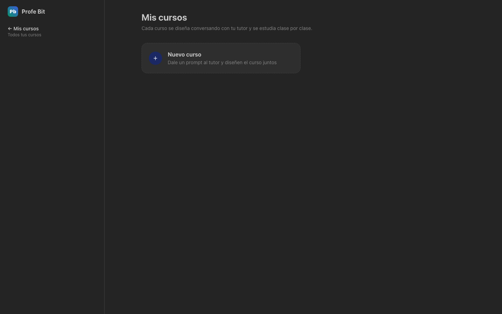

**2. Nuevo curso** — la creación es un chat: "¿Qué quieres aprender?".

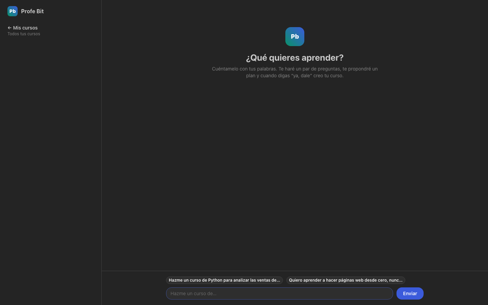

**3. El asesor NO crea de una** — resume lo entendido y pregunta el nivel.

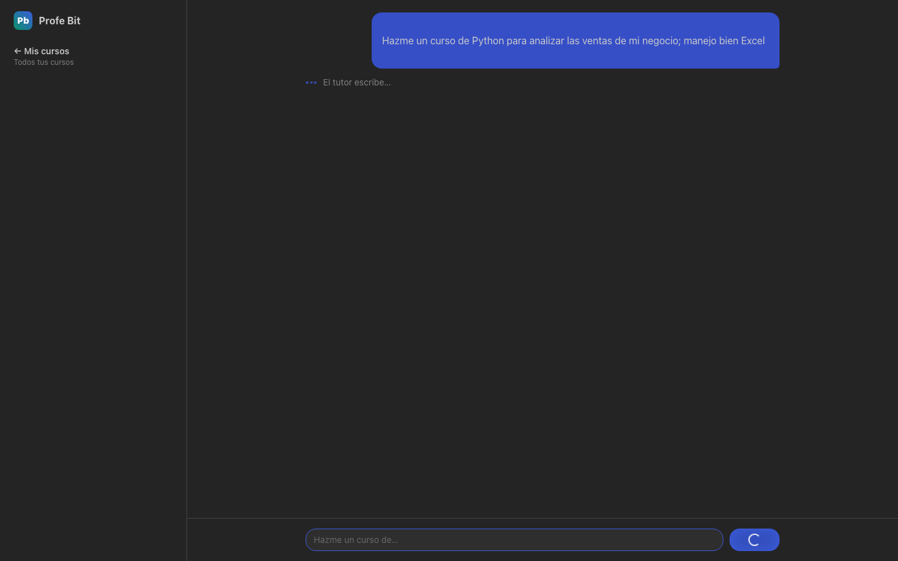

**4. Propuesta de temario** — lista de clases para ajustar o confirmar.

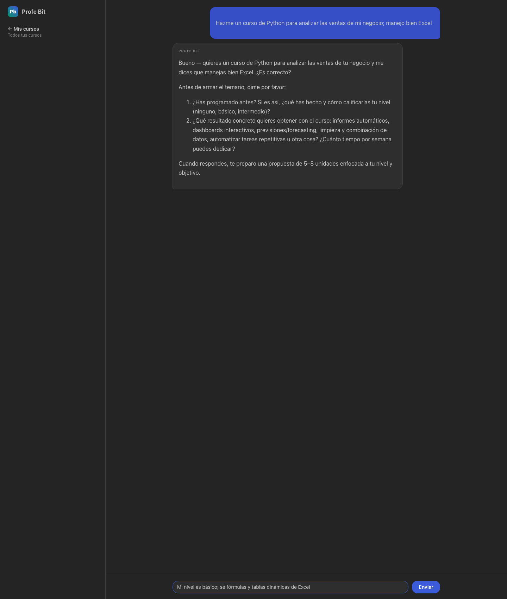

**5. Clase 1 en el chat** — confirmado el "ya, dale", arranca la lección
(guion PRIMM: pide predecir antes de explicar).

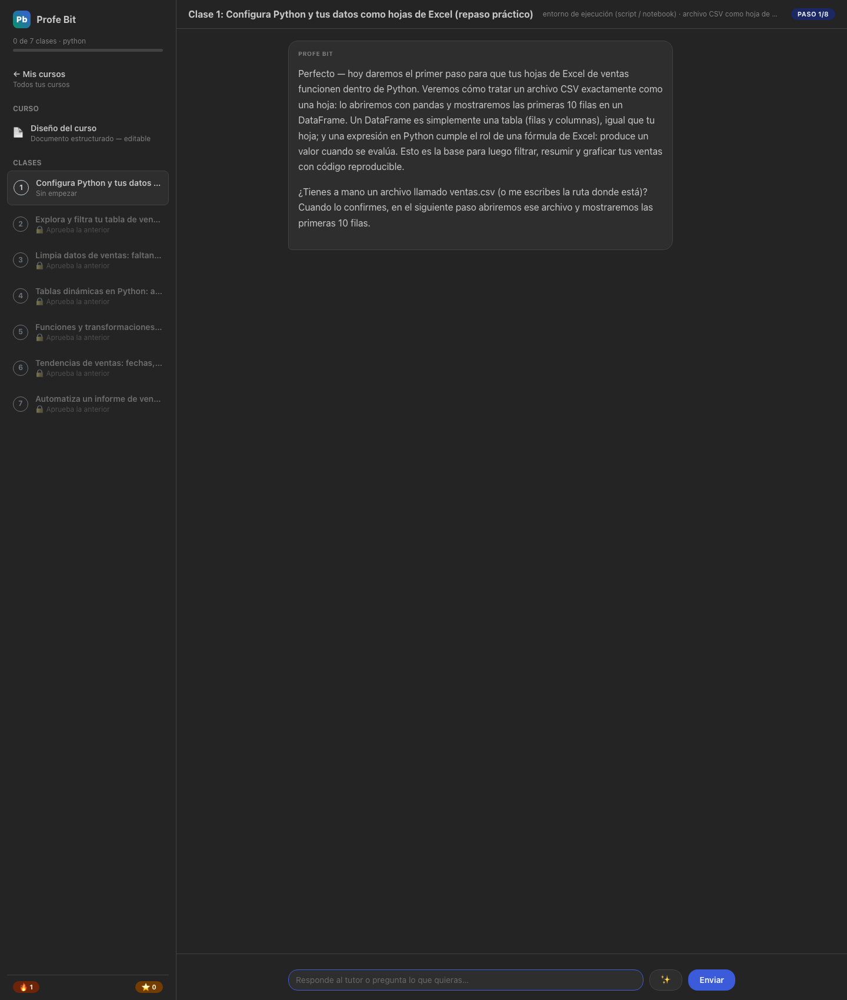

**6. Predicción errada a propósito** — el tutor corrige con amabilidad,
explica el porqué y avanza de paso.

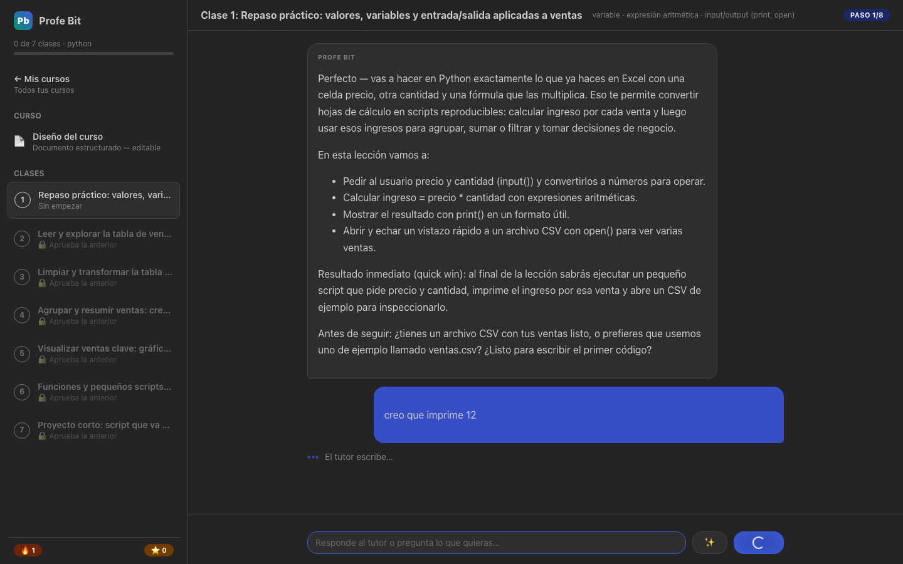

**7. Duda libre a mitad de clase** — el estudiante interrumpe con una
pregunta ("¿esto para qué me sirve en mi negocio?"); el tutor la responde y
retoma el paso **sin avanzar** la lección (decisión de avance con criterio).

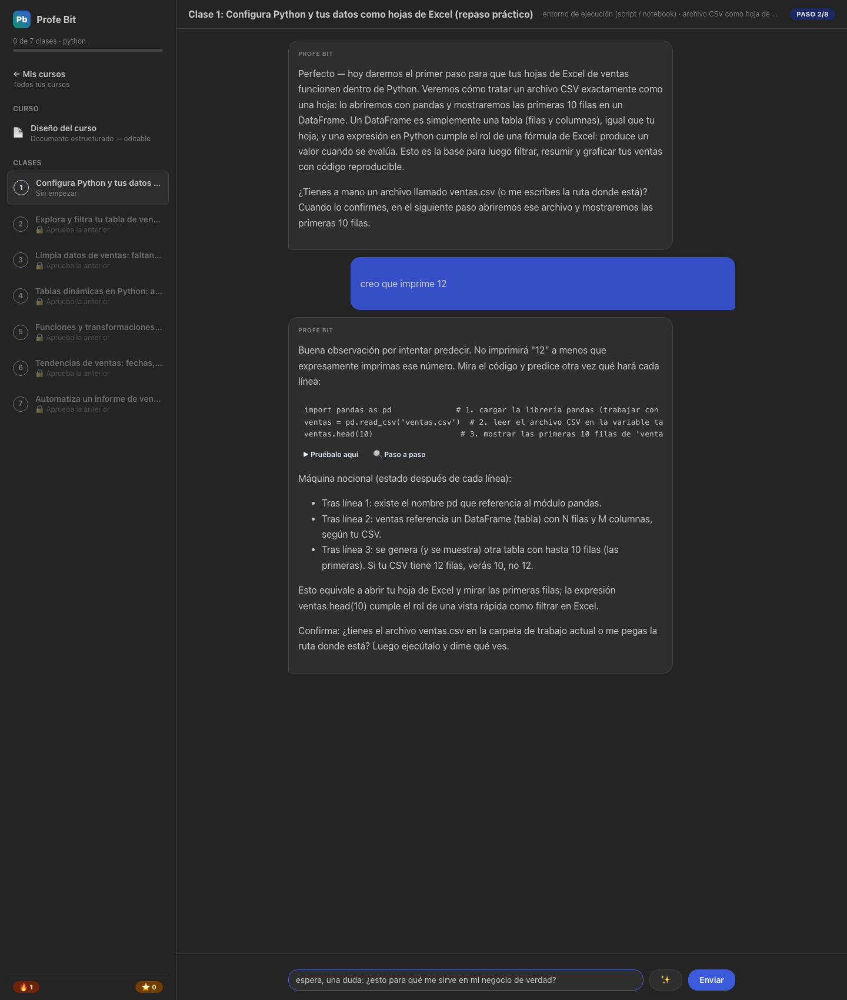

**8. Clase completada** — tras responder todos los pasos, la clase queda
tachada en la barra lateral, el tutor cierra con el recap y aparece el CTA
de evaluación; las clases 2-7 siguen con candado.

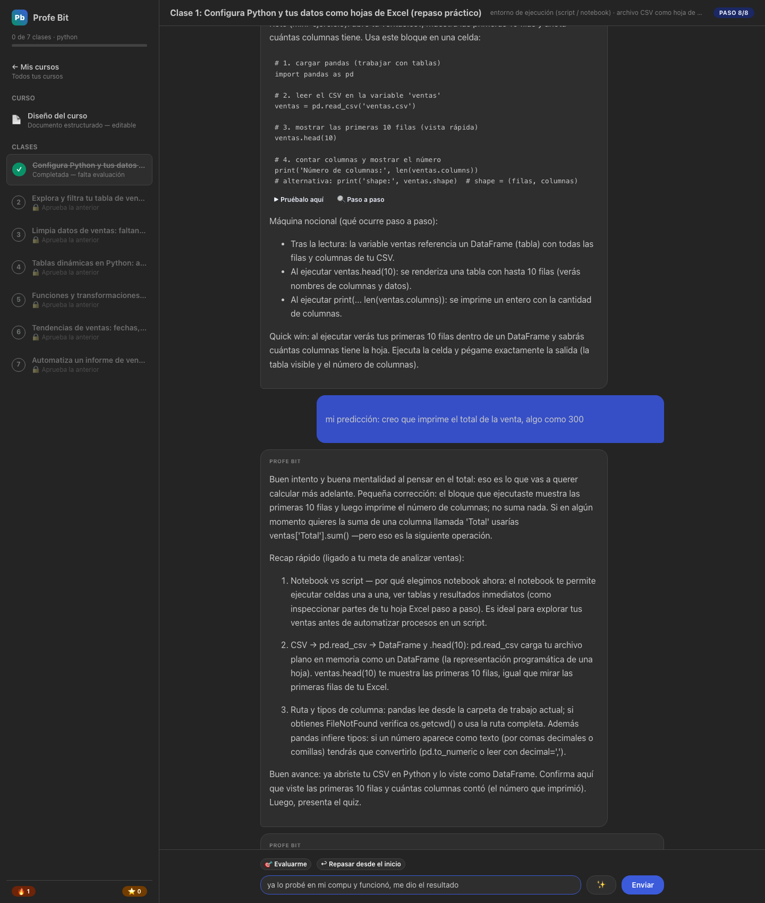

**9. Evaluación dentro del chat** — 4 preguntas de comprensión (predicción /
encuentra-el-bug) con distractores basados en misconceptions documentadas.

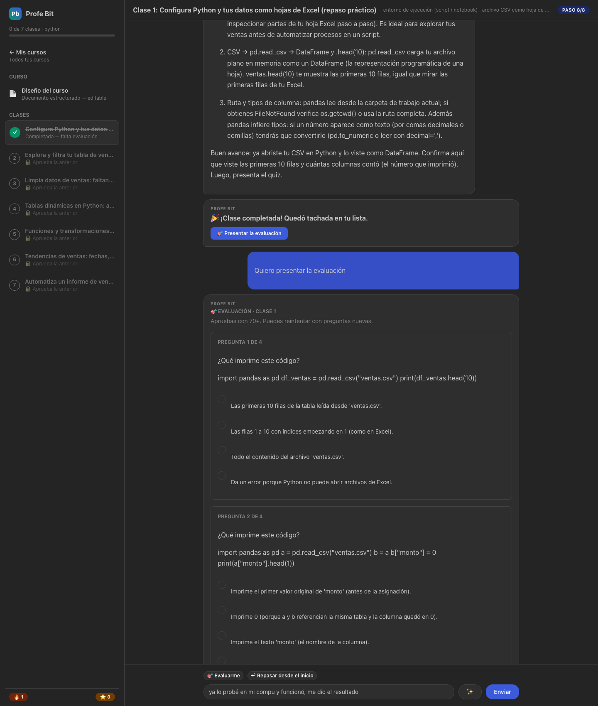

**10. Resultado (ruta de reprobar)** — respondí al azar a propósito y saqué 1 de
4: desglose por pregunta con la correcta y la explicación del error de
razonamiento, botón de reintento (con preguntas nuevas) y el conversatorio
socrático abriéndose automáticamente al final.

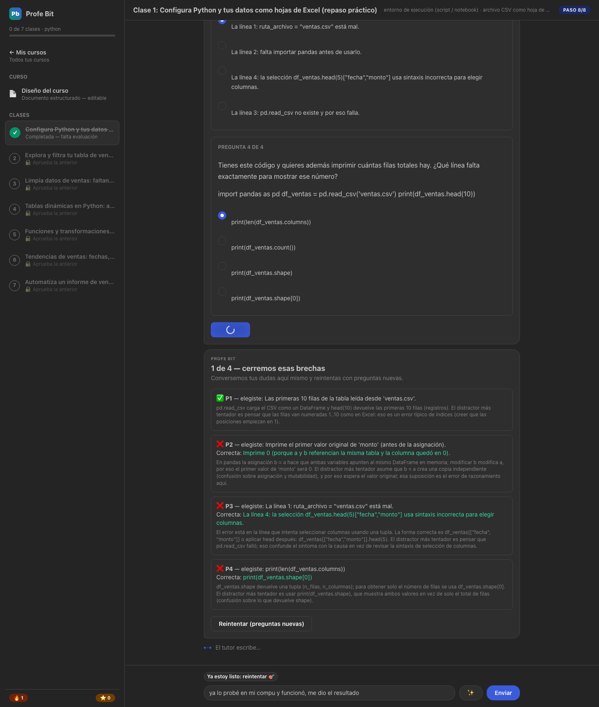

**11. Diseño del curso** — el documento generado (persistido en la BD, con
copia `curso.md` descargable).

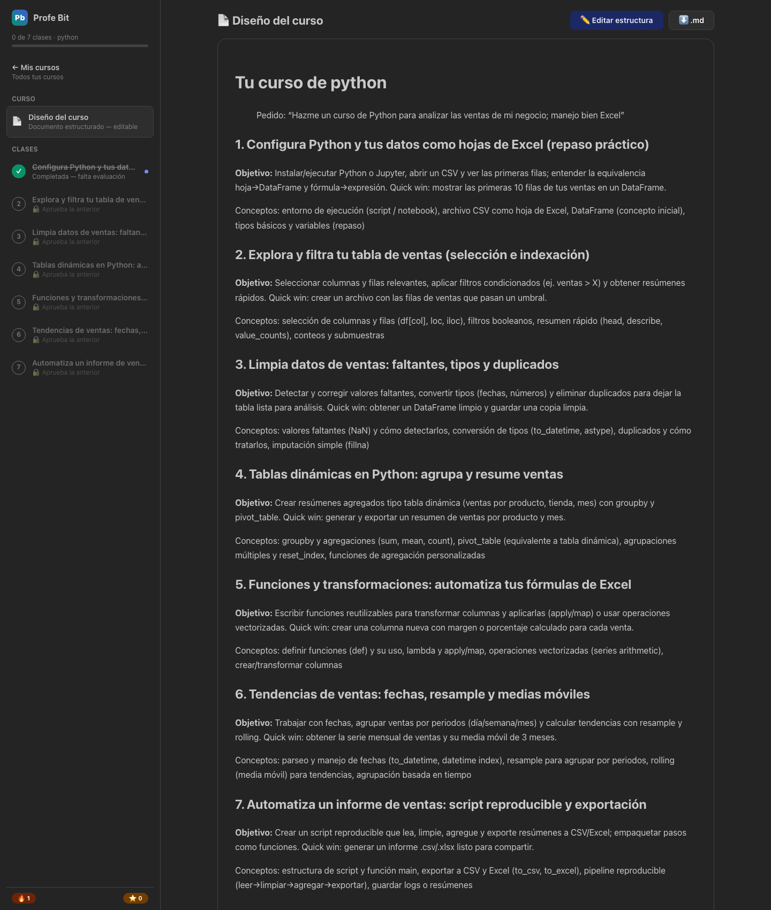

**12. Edición estructurada** — título/objetivo/subtemas por clase, validados
con las mismas reglas que usa el LLM.

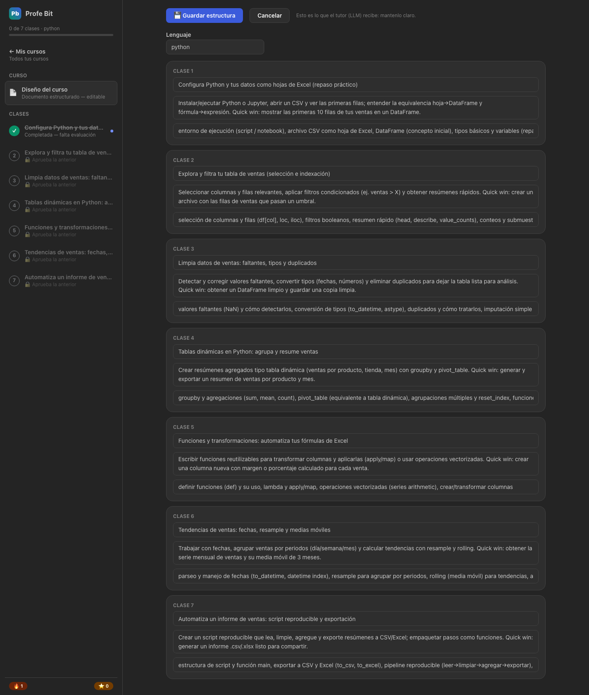

**13. Mis cursos con progreso** — el curso creado con su barra de avance.

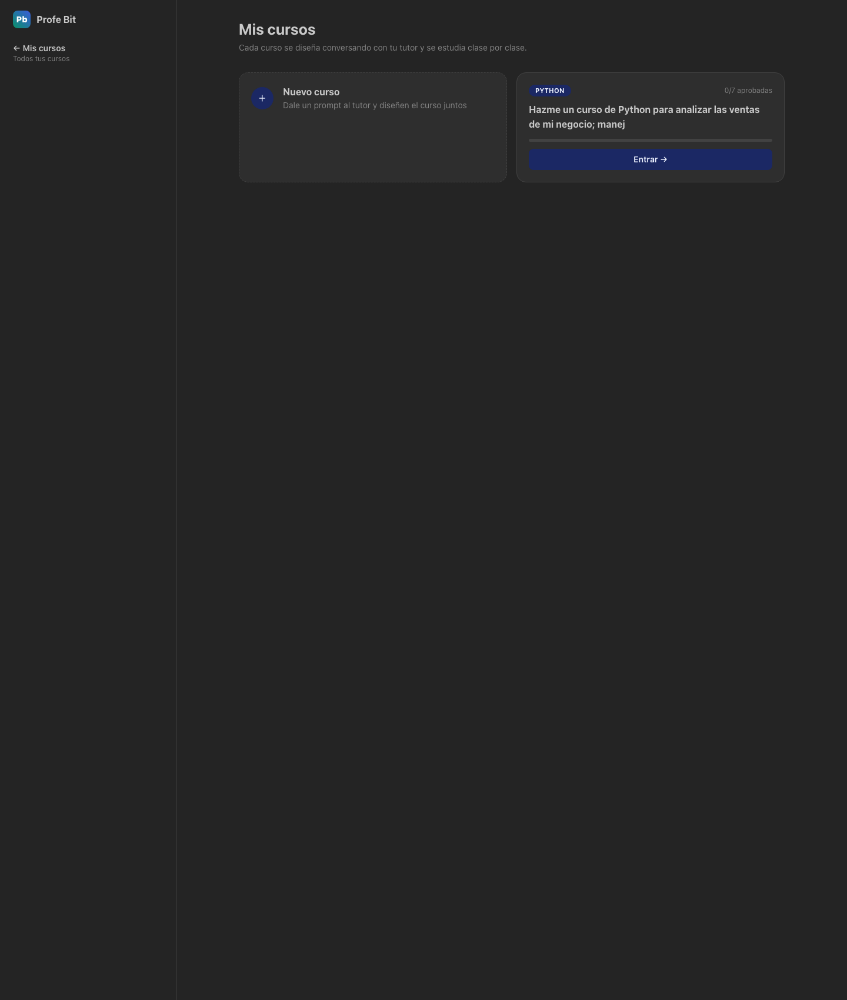
